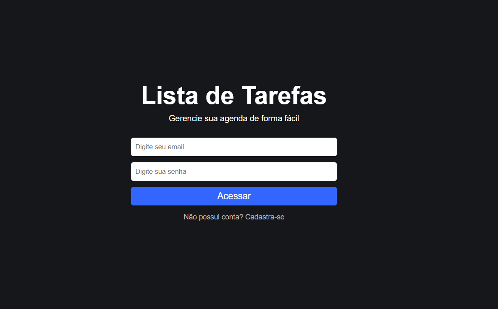
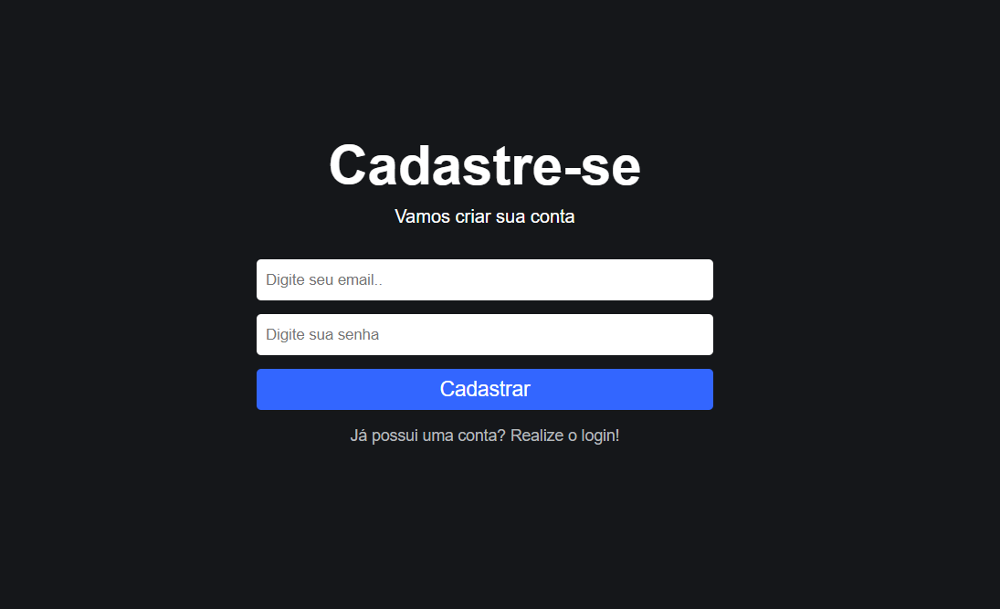
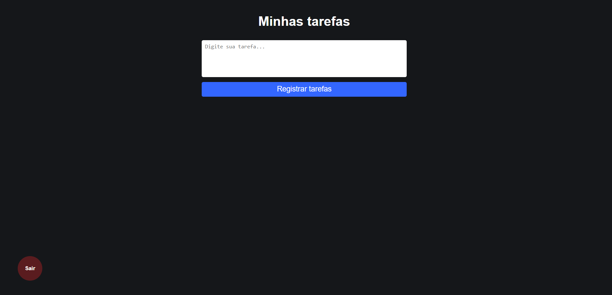
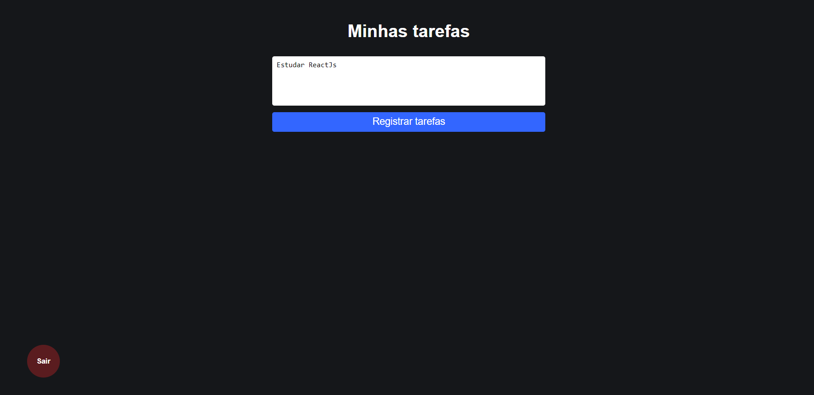
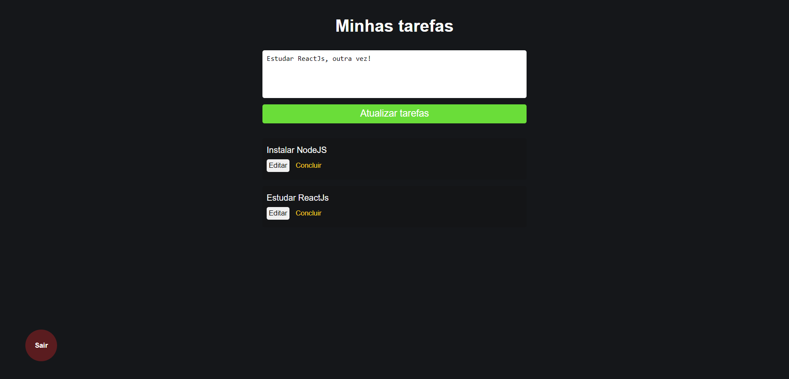

# App Controle Financeiro

## Resume
To-do application developed to apply the knowledge acquired in firebase, such as registration and user access and use of NoSQL database.

For this application, the ReactJs Framework was used, and it has user registration and login, a list of tasks individualized by user using the UID, as a search metric in the database. User can save, edit or delete his task.

* <u><b>Hooks</b></u>: useState, useEffect, useNavigate, useMemo.

* <u><b>Libraries</b></u>: Firebas/Auth, FirebaseFireStorage, react-router-dom.

* <u><b>Styled-components.</b></u>

* <u><b>Back-end</b></u>: FireBase, NoSql.

# Interface

## <u>SignIn screen:</u>

  

## <u>SignUp screen:</u>

  

## <u>Home screens:</u>

  

  

